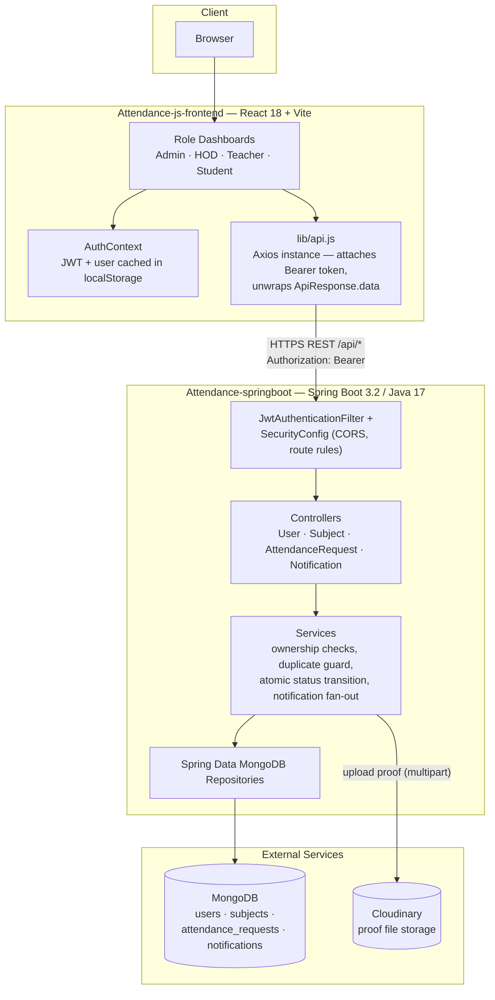
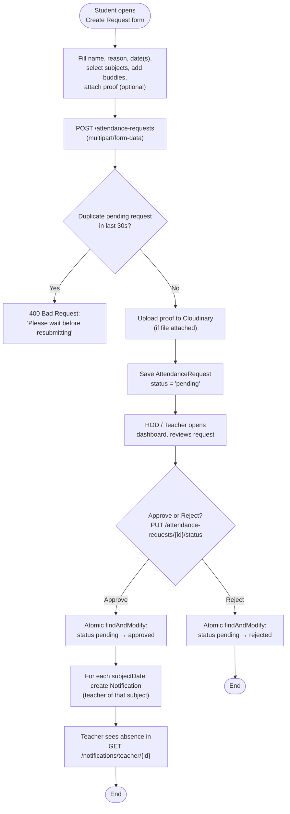

# Attendance Management System — Project Guide (Current State)

> This reflects the system as it stands today, not the original Node→Spring Boot migration snapshot. Several things changed after that first migration: file storage moved to Cloudinary, attendance requests became multi-student/multi-subject with department scoping, CSV bulk import was added, subject lookups are cached, and a full React frontend (4 role-based dashboards) was built on top.

## Project Structure

```
Attendance-springboot/
├── Dockerfile                                   # Multi-stage build (maven → jre)
├── src/main/
│   ├── java/com/attendance/
│   │   ├── AttendanceApplication.java           # @EnableCaching + ModelMapper bean
│   │   ├── config/
│   │   │   ├── SecurityConfig.java              # JWT filter chain, role-based authz + CORS source (single source of truth)
│   │   │   ├── CloudinaryConfig.java             # Cloudinary client bean
│   │   │   ├── MongoIndexConfig.java             # Partial unique index on `sap`
│   │   │   └── DemoDataInitializer.java          # Seeds demo accounts (feature-flagged)
│   │   ├── controller/
│   │   │   ├── UserController.java              # 12 endpoints incl. search + CSV import
│   │   │   ├── SubjectController.java            # 10 endpoints
│   │   │   ├── AttendanceRequestController.java  # 10 endpoints incl. department + proof
│   │   │   └── NotificationController.java       # 9 endpoints incl. date-range filter
│   │   ├── service/
│   │   │   ├── UserService.java
│   │   │   ├── SubjectService.java               # @Cacheable getSubjectById
│   │   │   ├── AttendanceRequestService.java      # multipart handling, Cloudinary upload
│   │   │   ├── NotificationService.java
│   │   │   ├── CsvImportService.java              # bulk user import
│   │   │   ├── CustomUserDetailsService.java
│   │   │   └── SecurityUtil.java
│   │   ├── entity/
│   │   │   ├── User.java                         # implements UserDetails, has `department`
│   │   │   ├── Subject.java
│   │   │   ├── AttendanceRequest.java             # studentIds[], subjectDates[], department
│   │   │   └── Notification.java                 # studentIds[] (not singular)
│   │   ├── repository/
│   │   ├── dto/
│   │   ├── security/
│   │   └── exception/
│   └── resources/
│       └── application.yml                       # + Cloudinary + demo-data flag
├── pom.xml
└── Attendance-js-frontend/                       # React 18 + Vite frontend
```

## System Architecture



**Layers at a glance**

| Layer | Responsibility |
|---|---|
| **React SPA** | 4 role dashboards, dark/light theme, form validation, calls the API through a single Axios client |
| **Spring Security + JWT filter** | Authenticates the bearer token and populates the security context; route-level rules live in `SecurityConfig` |
| **Controllers → Services** | Controllers are thin; services own business rules (ownership checks, the 30s duplicate-submission guard, the atomic pending→approved/rejected transition, notification creation) |
| **MongoDB** | Document store for all four collections, with `@Indexed` fields plus a partial unique index on `sap` |
| **Cloudinary** | Receives proof-of-absence file uploads directly from `AttendanceRequestService`; no files touch local disk |

## Workflow: Attendance Request Lifecycle

This is the end-to-end path a single attendance request takes, from a student filling out the form to a teacher seeing the resulting absence.



**Notes on the flow**

- **Side path (while pending):** the owning student can edit or delete their own request via `PUT`/`DELETE /attendance-requests/{id}` at any point before it's decided; both are blocked once the status leaves `pending`.
- **Department scoping:** a non-admin reviewer (HOD/teacher) must belong to the same department the request was stamped with (copied from the student at creation time), or the status update is rejected with `403`.
- **Rejections don't notify:** notifications are only fanned out on approval, one per `subjectDate`, addressed to that subject's teacher — a rejected request produces no notifications.
- **Atomicity matters:** the pending→decided transition uses `MongoTemplate.findAndModify`, so a second approve/reject call on an already-decided request fails cleanly instead of double-processing it.

## Prerequisites

- Java 17+, Maven 3.8+
- MongoDB (local or Atlas)
- A Cloudinary account (cloud name, API key, API secret) — proof documents are uploaded there, not saved to local disk
- Node.js & npm for the frontend

## Backend Setup

### 1. Configure `application.yml`

The real config now pulls everything from environment variables (see `application.yml`, not the old `.example` template):

```yaml
spring:
  data:
    mongodb:
      uri: ${MONGODB_URI}
  servlet:
    multipart:
      max-file-size: 10MB
      max-request-size: 10MB

server:
  port: ${PORT:8080}
  servlet:
    context-path: /api

app:
  jwtSecret: ${JWT_SECRET}
  jwtExpirationMs: 86400000
  demo-data:
    enabled: ${DEMO_DATA_ENABLED}
  base-url: ${APP_BASE_URL}
  upload:
    dir: ${UPLOAD_DIR:uploads/attendance-proofs}   # legacy path, mostly unused now (see Cloudinary note)

cloudinary:
  cloud-name: ${CLOUDINARY_CLOUD_NAME}
  api-key: ${CLOUDINARY_API_KEY}
  api-secret: ${CLOUDINARY_API_SECRET}
```

Required env vars: `MONGODB_URI`, `JWT_SECRET`, `CLOUDINARY_CLOUD_NAME`, `CLOUDINARY_API_KEY`, `CLOUDINARY_API_SECRET`. Optional: `PORT`, `DEMO_DATA_ENABLED`, `APP_BASE_URL`, `UPLOAD_DIR`.

### 2. Demo data (optional)

If `DEMO_DATA_ENABLED=true`, `DemoDataInitializer` seeds four accounts on startup (admin/hod/teacher/student), all with password `Demo@123`, skipping any that already exist by email:

| Email | Role | SAP |
|---|---|---|
| admin@demo.com | admin | DEMO-ADMIN |
| hod@demo.com | hod | DEMO-HOD |
| teacher@demo.com | teacher | DEMO-TEACHER |
| student@demo.com | student | DEMO-STUDENT |

### 3. Build & Run

```bash
mvn clean install
mvn spring-boot:run
```

Or with Docker:

```bash
docker build -t attendance-backend .
docker run -p 8080:8080 --env-file .env attendance-backend
```

Backend serves at `http://localhost:8080/api`.

## Frontend Setup (Attendance-js-frontend)

Stack: React 18 + Vite, Tailwind CSS v4, shadcn/ui components on Radix primitives (`dialog`, `dropdown-menu`, `avatar`, `select`, `tabs`, `slot`), `react-hook-form`, `react-datepicker`, `date-fns`, `lodash`, `axios`.

```bash
cd Attendance-js-frontend
npm install
npm run dev
```

`src/lib/api.js` points to `VITE_API_BASE_URL` (defaults to `http://localhost:8080/api`), attaches the JWT bearer token automatically, and **unwraps the `ApiResponse` envelope** — every component receives `response.data` as the raw payload (array/object), not `{success, message, data}`.

### Role-based dashboards

- **AdminDashboard** — tabs for User Management (search/filter/add/bulk-CSV-add/bulk-delete-by-role) and Timetable Management (weekly grid, per-class/day, CSV export/import).
- **HodDashboard** — sees all attendance requests scoped to their own `department` via `GET /attendance-requests/department/{department}`, approves/rejects with a feedback note (UI field only — see note below).
- **TeacherDashboard** — date-range view of student absences, grouped by subject + date, pulled from `GET /notifications/teacher/{id}?startDate=&endDate=`.
- **StudentDashboard** — create/edit/delete their own requests; can select multiple subjects, a single date or a date range, add other students to the same request ("buddy" requests), and attach a proof file.

> **Known frontend/backend mismatch:** the HOD and Student UIs read/write a `feedbackNote` field when approving/rejecting requests, but the backend's `AttendanceRequestDTO` / `updateRequestStatus` do not currently persist or return one. That note is dropped silently today.

## API Endpoints (current)

### Users — `/users` (12)
```
POST   /users/login                  # returns JWT + UserDTO
GET    /users
GET    /users/{id}
GET    /users/search?query=&role=    # role defaults to "all"
GET    /users/teachers
GET    /users/role/{role}
GET    /users/class/{className}
POST   /users
PUT    /users/{id}
DELETE /users/{id}
DELETE /users/bulk/{role}
POST   /users/bulk/csv               # multipart "file"
```

### Subjects — `/subjects` (10)
```
GET    /subjects
GET    /subjects/{id}                # @Cacheable("subjects")
GET    /subjects/teacher/{teacherId}
GET    /subjects/class/{className}
GET    /subjects/day/{day}
GET    /subjects/schedule/{className}/{day}
GET    /subjects/search?query=
POST   /subjects
PUT    /subjects/{id}                # @CacheEvict
DELETE /subjects/{id}                # @CacheEvict
```

### Attendance Requests — `/attendance-requests` (10)
```
GET    /attendance-requests
GET    /attendance-requests/{id}
GET    /attendance-requests/student/{studentId}     # own + "included in" requests, merged
GET    /attendance-requests/status/{status}
GET    /attendance-requests/stats/{studentId}
GET    /attendance-requests/department/{department}  # NEW — HOD view
POST   /attendance-requests           # multipart/form-data, not JSON — see API docs
PUT    /attendance-requests/{id}      # multipart/form-data
PUT    /attendance-requests/{id}/status
DELETE /attendance-requests/{id}
GET    /attendance-requests/proof/{filename}   # legacy local-disk fallback, unused in practice
```

### Notifications — `/notifications` (9)
```
GET    /notifications
GET    /notifications/{id}
GET    /notifications/teacher/{teacherId}?startDate=&endDate=   # NEW date filters
GET    /notifications/student/{studentId}
GET    /notifications/unread
GET    /notifications/attendance-request/{attendanceRequestId}
POST   /notifications
PUT    /notifications/{id}/read
DELETE /notifications/{id}
```

## What Changed Since the First Migration

- ✅ **Cloudinary** replaces local disk storage for proof documents (`AttendanceRequestService.saveProofFile`); `application.yml.example`'s `UPLOAD_DIR` path is now vestigial.
- ✅ **Department** added to `User` and `AttendanceRequest`; HOD dashboards filter by it.
- ✅ **Bulk/group attendance requests**: a request now carries `studentIds[]` (other students included) alongside the primary `studentId`, and `subjectDates[]` (multiple subject+date pairs) instead of one subject.
- ✅ **Attendance request create/update moved to `multipart/form-data`** (to support the proof file upload) — no longer plain JSON bodies.
- ✅ **CSV bulk user import** (`/users/bulk/csv`) using Apache Commons CSV.
- ✅ **Caching** on `SubjectService.getSubjectById` via Spring Cache (`@EnableCaching` in `AttendanceApplication`).
- ✅ **Duplicate-submission guard**: rejects a new request if an identical pending one (same student + reason) was created in the last 30 seconds.
- ✅ **Atomic status transitions**: `updateRequestStatus` uses `MongoTemplate.findAndModify` so only a currently-`pending` request can move to approved/rejected; notifications are only generated on approval, one per subject/date, addressed to that subject's teacher.
- ✅ **Partial unique index** on `sap` (only enforced when `sap` is non-empty) via `MongoIndexConfig`, so teachers/HODs/admins without a SAP number don't collide on `null`.
- ✅ **Endpoint-level authorization enforced**: `SecurityConfig.filterChain` now maps every route to an explicit `hasRole(...)` / `hasAnyRole(...)` / `authenticated()` rule — only `ADMIN` can bulk-delete or CSV-import users, only `STUDENT` can create a request, only `HOD`/`TEACHER` can approve or reject one, and so on. Requests with a missing, invalid, or under-privileged token are rejected with `401`/`403` at the filter chain, before they reach a controller. Fine-grained *ownership* checks (e.g. "only the requesting student or an admin can edit this exact request") still live in the service layer, since that can't be expressed as a static URL pattern.
- ✅ **Single CORS configuration**: the legacy `CorsConfig` (`WebMvcConfigurer`) has been removed. `SecurityConfig.corsConfigurationSource()` — wired directly into the security filter chain — is now the only CORS source (allows `localhost:*`, `192.168.*.*:*`, `*.vercel.app`).
- ✅ Full **React frontend** built: 4 role dashboards, dark/light theme, shadcn/ui components.

## Common Issues

**MongoDB connection failed** — verify `MONGODB_URI`.
**Cloudinary upload failing** — verify all three `CLOUDINARY_*` env vars are set; `saveProofFile` throws a `RuntimeException` wrapping the IOException if the upload fails.
**Port in use** — set `PORT` env var.
**JWT errors** — check `JWT_SECRET` is set and at least 256 bits.
**CORS blocked** — confirm your frontend origin matches the patterns in `SecurityConfig.corsConfigurationSource`.

---
**Backend:** Spring Boot 3.2.0 · Java 17 · MongoDB · JWT · Cloudinary
**Frontend:** React 18 · Vite · Tailwind v4 · shadcn/ui